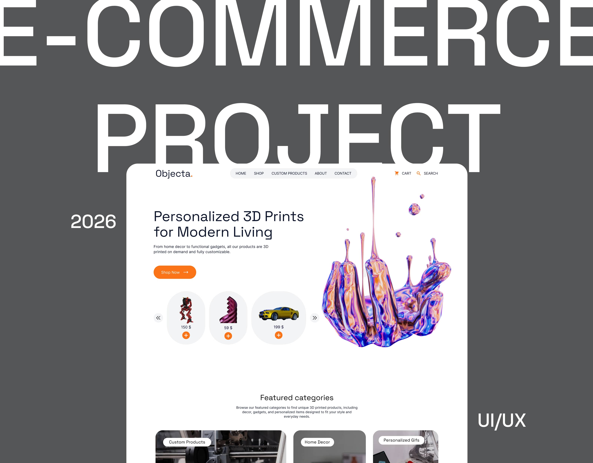
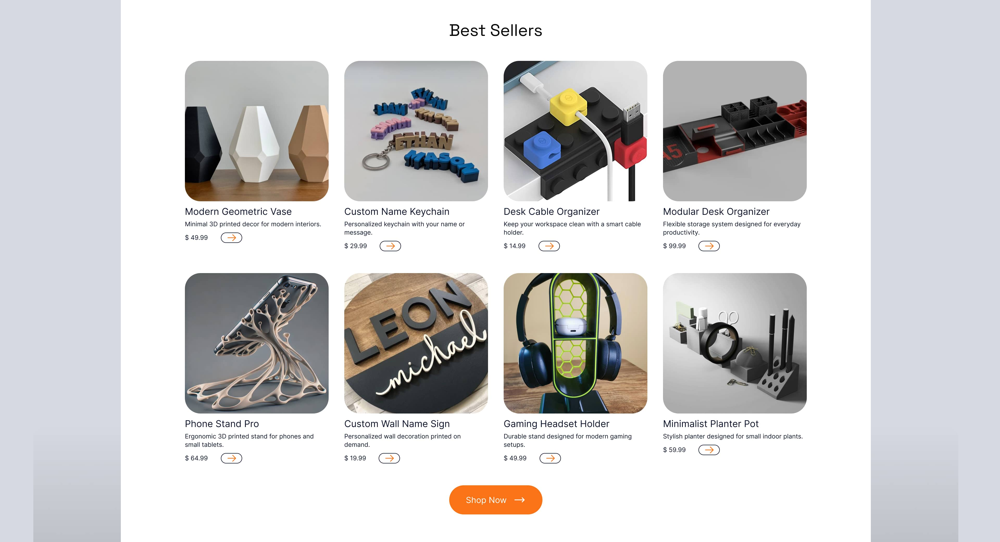
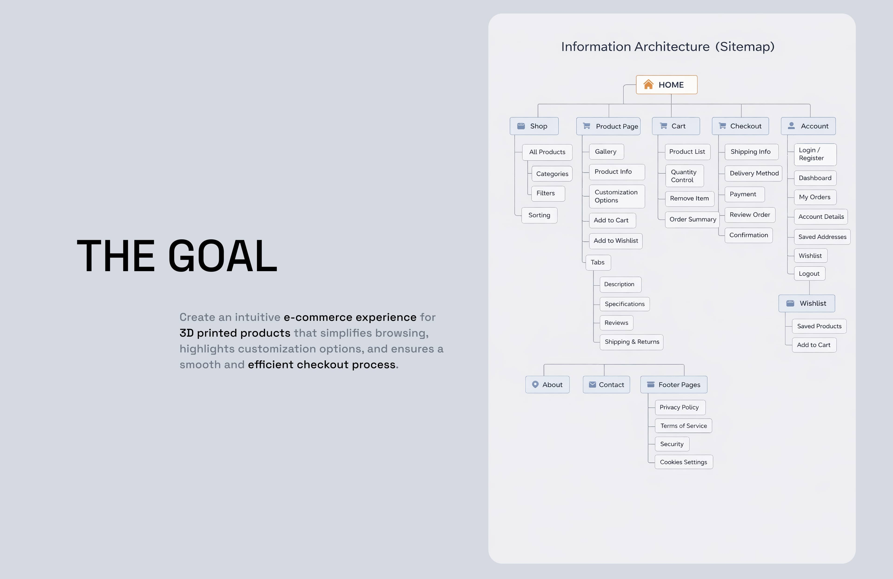
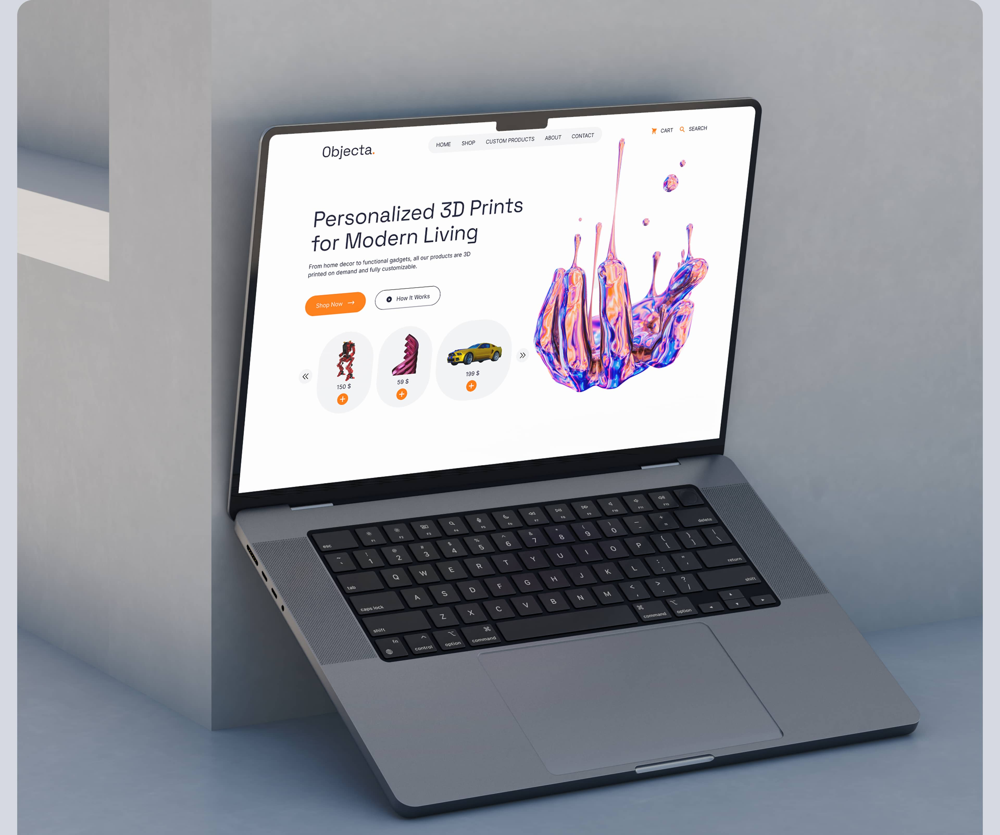

# Modern E-Commerce Website UI/UX Design

Designed a modern e-commerce website concept focused on improving product presentation, navigation, and user experience.

## Goals
- Improve visual hierarchy
- Create a cleaner shopping experience
- Increase usability and engagement
- Build a more premium visual direction

## Tools
- Figma
- Webflow
- Photoshop

## Key Features
- Responsive layout
- Modern typography
- Structured product sections
- Conversion-focused UI
- Mobile-friendly design

## Preview

### Hero Section

### Product Section

### Sitemap

### Desktop View

